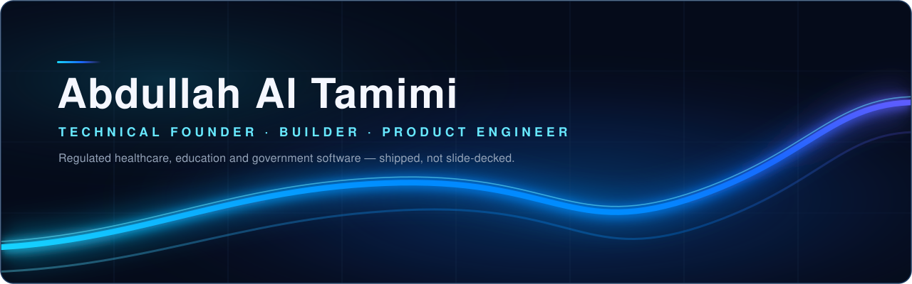
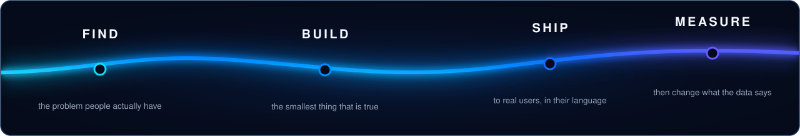

  

  <b>I build software for domains where being wrong has consequences</b> — medication safety,
  university learning records, government service delivery. Regulated data on one side,
  a person who just needs a clear answer on the other. I build the layer in between.

  
  
  
  
  

## What I Build

Most software in my region fails at the same seam: an authoritative source exists — a
regulator's leaflet, a university's gradebook, a ministry's complaint log — and it is
technically available and practically unusable. The data is correct. Nobody can act on it.

That seam is what I work on. Three rules I hold to:

- **The authoritative source stays authoritative.** I don't generate a second version of the
  truth. Nashrati doesn't write drug leaflets; the regulator does. My reporting layer doesn't
  recompute Moodle's grades; Moodle owns them. My job is presentation, explanation and
  navigation — never a competing answer.
- **Arabic is not a translation pass.** RTL, Arabic clinical vocabulary and Arabic-first
  layouts go in at the start, because the person I'm building for reads Arabic first.
- **Ship into someone's hands.** A demo that survives a ministry presentation, a pharmacist
  actually scanning a box, a teacher opening a report on a Sunday. Not a repo that builds.

I move across the stack because these products need it — a GS1 barcode parser, an E2B XML
export, a PHP Moodle plugin and a React chart are all the same problem wearing different clothes.

## Currently Building

<table>
<tr><td width="33%" valign="top">

**Nashrati**
`Medication safety`

The patient layer over official governmental drug leaflets.

→ *Now:* adverse-event reporting that exports to regulator-grade E2B / CIOMS XML.

</td><td width="33%" valign="top">

**LCMS GATE**
`University reporting`

Teacher- and institution-facing analytics over a real Moodle.

→ *Now:* the reports engine — saved templates, AND/OR filter groups, honest CSV export.

</td><td width="33%" valign="top">

**Terhal · ترحال**
`Tourism marketplace`

Ma'an governorate beyond Petra: plan a trip, book a local guide at a visible price.

→ *Now:* the provider-side app so guides list and get paid.

</td></tr>
</table>

## Featured Products

### Nashrati — the patient layer over official drug leaflets

> Jordan mandated electronic drug leaflets. The leaflet became digital. It did not become
> readable. A patient still gets a wall of regulatory prose that answers a regulator's
> question, not theirs: *can I take this with my blood-pressure medicine?*

**Nashrati does not author leaflets.** The official governmental leaflet remains the
authoritative source, always cited as the source. Nashrati builds the patient journey on top
of it: scan the box, know the medicine is real, and read the leaflet as it applies to *you*.

| | |
|---|---|
| **Problem** | Official electronic leaflets are authoritative and unreadable. Patients can't act on them; adverse reactions go unreported because the reporting form is built for pharmacovigilance officers, not people. |
| **What I built** | A GS1 DataMatrix scanner that parses GTIN, serial, batch and expiry straight off the pack for product verification. An AI "Smart View" that restates the *official* leaflet against the patient's own profile — conditions, allergies, current medications, lifestyle. A 5-step adverse-reaction wizard in plain language (*"I had to see a doctor"*) that maps to MedDRA 27.0 preferred terms behind the scenes, captures dechallenge/rechallenge, and exports **E2B / CIOMS XML**. A pharmacist console that publishes structured dosage guidance with a mandatory, immutable source attribution — *Official Leaflet* or *Physician's Prescription* — logged for accountability. |
| **Built with** | React 19 · TypeScript · Vite · Tailwind · Supabase (Postgres, Auth, RLS) · OpenAI · i18next (Arabic/English, full RTL) · `html5-qrcode` + `bwip-js` · Framer Motion |
| **Standards** | GS1 DataMatrix · MedDRA 27.0 · E2B / CIOMS · three roles: patient, pharmacist, manufacturer |
| **My role** | Sole builder — product, schema, pharmacovigilance data model, UI, both languages. |

The hardest part wasn't the code. It was drawing the line between *presenting a regulator's
document* and *giving medical advice* — and keeping every screen on the right side of it. The
Digital Twin is labelled, in the product, as a *situational awareness mirror, not medical advice*.

Private repository · [published leaflet renderings: Clinton® (Etoricoxib)](https://abdullatam.github.io/clinton-leaflet/) · [Clavudar®](https://abdullatam.github.io/clavudar-leaflet/) · [Flagyl®](https://abdullatam.github.io/flagyl-leaflet/)

---

### LCMS GATE — the control plane around Moodle

> Universities don't need a new LMS. Moodle already is the academic system of record and
> replacing it is not a real option. What's missing is everything *around* the course:
> authoring, reuse, and reporting a teacher can actually open.

The governing rule of the system: **Moodle remains the academic system of record.** Nothing in
the platform computes a second answer to a question Moodle already answers — it presents and
explains Moodle's verdict. A single gate service is the only component allowed to talk to
Moodle; everything above it consumes source-neutral contracts.

| | |
|---|---|
| **Problem** | Teachers can see that a student is failing. They can't see *why*, or who hasn't started the video, or which quiz question the whole cohort got wrong — without exporting three CSVs by hand. |
| **What I built** | I own the reporting and analytics surface. The report engine: saved templates, AND/OR filter groups, column controls, and a CSV export that matches what's on screen. Per-question quiz statistics, carried through a new Moodle plugin contract. Video watch analytics — *"N have not started this video"*, from measured viewing rather than a completion tick. Institutional prediction models with visible thresholds, alerts and action plans. Plus the data-viz primitives the whole platform renders on, and Arabic/English copy for every reporting surface. |
| **Built with** | FastAPI · React 19 · TypeScript · PHP (Moodle plugin, `local_lcms_gate`) · Postgres · Docker Compose · Helm / Kubernetes · pytest |
| **My role** | Contributor on a team — **I own teacher reporting, institutional analytics and the gate endpoints behind them** (~110 commits). Architecture and the Moodle seam are shared work. |

---

### Terhal · ترحال — tourism revenue that reaches the town

> Petra takes roughly 900,000 visitors a year. Almost all arrive from Amman, spend four hours
> in the Siq, and leave. Ma'an governorate has Jordan's highest unemployment rate — and
> Shobak's crusader castle is an hour away, seeing close to none of it.

| | |
|---|---|
| **Problem** | There's no shortage of demand or of sites. There's no trusted channel connecting the two — so pricing is opaque, unlicensed touts dominate the gate, and revenue leaks to outside operators. |
| **What I built** | The provider side. Six guide-facing screens on the shared backend, the role-gating entry flow that splits tourist from guide, a camera guide backed by OpenAI vision, and a Ma'an-specialist chat assistant. I rebuilt the tourist frontend onto the Terhal design system and wired the landmark gallery, profile and reviews endpoints. |
| **Built with** | FastAPI · Postgres · React 18 · Tailwind · Leaflet · OpenAI (chat + vision) · Arabic and English throughout |
| **My role** | Repository owner, provider-side lead. Built for the Ma'an Hackathon for Entrepreneurship (Irada Program). |

---

### VoC-360 — national citizen-experience intelligence

A microservice platform turning citizen complaints into something a minister can act on:
ingestion → NLP, personas, archetypes, root-cause → BI and experience layers.

I worked the **intelligence and BI layer and the Minister View**: unified the CXI score onto a
single persisted, coverage-flagged number instead of competing calculations; made sector scope
**fail closed** on an unresolvable crosswalk rather than silently widening; moved the default
snapshot period to a rolling window; and took a hot snapshot path from parse-many to
parse-once/slice-many for a measured **4.77×** speedup. On the front end, the root-cause
decision brief and the Minister View severity-report cards.

`Python` · `FastAPI` · `pandas` · `React` — team platform under the 9XAI program.

---

### Tammy AI — a co-founder that remembers

**Live at [tammy-ai.com](https://tammy-ai.com/).** Not a chatbot: an AI that holds the thread
across every session — emotional trajectories, contradictions, avoidance patterns — and answers
with *insight → tension → question* rather than empathy and validation.

The engineering problem is memory. Three tiers behind one interface: Redis for the live
conversation, MongoDB for sessions and profiles, Pinecone for semantic recall and RAG over a
proprietary corpus — with a query classifier deciding which tier a question actually needs and a
context builder assembling the prompt under a hard token budget. Voice in and out, Arabic and
English.

`FastAPI` · `SSE streaming` · `Claude` (primary) → `OpenAI` (fallback) · `Pinecone` · `MongoDB` ·
`Redis` · `LangChain` · `Speechmatics` STT · OpenAI TTS — [repo](https://github.com/abdullatam/tammyai)

Built with Tamer Masri and Omar.

---

<b>More things I've built</b>

 

| Project | What it is | Stack |
|---|---|---|
| **Moodle Team 1 — Course Builder & Player** | Rebuilt the essential parts of how Moodle represents a course — availability trees, completion rules, reuse — by understanding it, not copying it. **My scope: copy, backup, restore, `.mbz` import, date-shifting and the honest ledger of what information gets lost.** | FastAPI · SQLite · React · TypeScript · Vite |
| **Nasher AI** | AI content platform for government. I built the full frontend from scratch — idea search, AI generator, dashboard, content library, workflow, bilingual EN/AR — and ran the RAG pipeline, backend and frontend together locally. Produced the Ministry Alignment Report. | React · FastAPI · RAG · Docker Compose |
| **Traffic monitoring & flow forecasting** | 9XAI hackathon, solo repo. A reproducible data sandbox for Wasfi Al-Tal / Mecca St, Amman — 22 detectors × 14 days of counts, signal logs, labelled ground-truth events — a SUMO simulation network, YOLO live licence-plate detection (NMS + spatial tracking + majority vote) served as an annotated MJPEG stream, and a bilingual what-if signal-timing simulator. | Python · Ultralytics YOLO · SUMO · pandas private repo |
| **HTUFoundIt** | Lost-and-found platform for Al-Hussein Technical University. Students report lost items, browse found ones, manage their reports. | React · Auth0 · Node.js · Express · PostgreSQL · [frontend](https://github.com/abdullatam/HTUFoundIt-Frontend) · [backend](https://github.com/abdullatam/HTUFoundIt-Backend) |
| **LeafleX** | The predecessor to Nashrati and the reason I know this domain: a builder for Jordan's newly mandated digital leaflets, converting unstructured pharmaceutical leaflets into structured, JFDA/HL7-compliant XML. | [repo](https://github.com/abdullatam/LeafleX-1) |

## The Journey

| | Stage | What actually happened |
|---|---|---|
| **2023** | Foundation | Computer Science at Al-Hussein Technical University. First repos, first ugly code. |
| **2025** | Fundamentals | Full-stack in earnest — REST APIs, Postgres, auth. HTUFoundIt shipped as a real service for a real campus, not a course exercise. |
| **2024 →** | LeafleX | Jordan mandates electronic drug leaflets. I go deep on pharmaceutical regulatory structure — XML, JFDA, HL7 — and learn the domain that everything since has been built on. |
| **2026 · Q1** | 9XAI Fellowship | On the 9XAI / OLC program at HTU. Point of contact, then frontend developer, then governance and compliance on **Nasher AI**; architect on a multi-agent automation tool; lead presenter through to the ministry presentation. Three role changes, delivered in each. |
| **2026 · Q2** | Scale | **VoC-360** — a national platform, 3,700+ commits across many teams. Where I learned that the hard part of BI is making one number mean one thing. |
| **2026 · Q3** | Product | **Nashrati** from zero. **LCMS GATE** reporting. **Terhal** for the Ma'an hackathon. Building products end to end, in Arabic and English. |

## Experience

**Founder — [LeafleX](https://www.linkedin.com/company/leaflexx) / Nashrati** · Jordan
- Built Nashrati end to end: a bilingual medication-safety product with GS1 pack verification, a MedDRA-coded adverse-reaction pipeline exporting E2B/CIOMS XML, and a pharmacist accountability log.
- Designed the Postgres schema and RLS model for patient, pharmacist and manufacturer roles.
- Drew and defended the product boundary between presenting an official leaflet and giving medical advice — the constraint that shaped every screen.

**Product & Platform Engineer — 9XAI Program, Al-Hussein Technical University** · 2026
- **LCMS GATE:** own teacher reporting and institutional analytics over a real Moodle — report engine, per-question quiz statistics through a new plugin contract, video watch analytics, prediction thresholds and alerts (~110 commits).
- **VoC-360:** unified the national CXI score onto one persisted, coverage-flagged figure; made sector-scope resolution fail closed; 4.77× measured speedup on the snapshot path; rebuilt the Minister View report cards.
- **Nasher AI:** built the entire bilingual frontend from scratch and ran the full RAG + backend + frontend stack locally; authored the Ministry Alignment Report; presented three times a week through to the ministry-facing final.

**Hackathon Builder** · 2026
- **Terhal** (Ma'an Hackathon for Entrepreneurship, Irada Program): repo owner; built the entire guide-provider application and the OpenAI-vision camera guide.
- **Moodle Team 1** (Four Days Inside Moodle): owned course copy, backup, restore and `.mbz` import — including the deliberate ledger of what information does *not* survive a round trip.
- **9XAI Traffic Hackathon:** sole author of the traffic repo — the reproducible data sandbox (22 detectors × 14 days, signal logs, labelled events), the SUMO network, and YOLO live plate detection with NMS, spatial tracking and majority-vote consensus.

## Tech Stack

Everything below is in something I've actually shipped.

**Languages**

**Frontend**

**Backend**

**Data**

**AI**

**Infrastructure**

**Domain standards**

`GS1 DataMatrix` · `MedDRA 27.0` · `E2B / CIOMS` · `HL7` · `JFDA electronic leaflets` · `Moodle .mbz` · `SUMO`

## Tools

| | |
|---|---|
| **Build** | VS Code · Git · GitHub · Docker Desktop · Postman-style API work via FastAPI `/docs` |
| **AI** | Claude Code · Claude · ChatGPT · Ollama for local models |
| **Data** | Supabase Studio · RedisInsight · Jupyter notebooks |
| **Product & design** | Figma · design-system exports as the visual source of truth · Mermaid for architecture |
| **Collaboration** | GitHub PRs and branch integration across multi-team repos · Markdown-first documentation |

## How I Build

  

## Activity

  

Most of my product work lives in private repositories and organisation accounts —
Nashrati, LCMS GATE and VoC-360 among them. The public graph is a fraction of the picture.

## Let's Build Something

I'm interested in problems where an authoritative source exists and nobody can use it —
health, education, government, regulated data. If that's what you're working on, or you want
to talk about building products in Jordan and the region, reach out.

  
  
  

<b>Abdullah Al Tamimi</b> · Jordan · Building at the intersection of AI, software and entrepreneurship.

